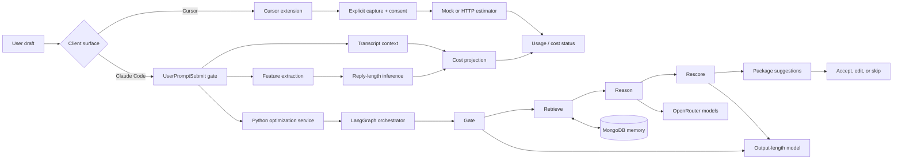

# TokenLens

<p align="center">
  <strong>See the cost of an AI coding prompt before it runs, then make the prompt better.</strong>
</p>

<p align="center">
  <a href="https://www.loom.com/share/be931c5e8473415e87eecf0c252cb016"><strong>▶ Watch the demo</strong></a>
</p>

TokenLens is a local-first toolkit for estimating and reducing the cost of AI
coding prompts. It brings the estimator clients, Claude Code integration,
optimization agent, persistent memory, and model boundary into one repository.

The project supports two complementary workflows:

- **Estimate** — inspect the likely usage or cost of a prompt before sending it
  from Cursor or Claude Code.
- **Optimize** — retrieve useful patterns from previous sessions, generate a
  small set of clearer rewrites, rescore them, and let the user choose what to
  send.

## What we built

- A Cursor/VS Code extension with explicit clipboard, selection, and Quick Input
  capture; endpoint consent; cancellation; and a compact status-bar result.
- A Claude Code estimator plugin that reads the local transcript context,
  extracts a versioned feature payload, predicts reply length through a local
  inference boundary, and pauses expensive prompts for confirmation.
- A Python optimization service that runs a `gate → retrieve → reason → rescore
  → package` graph and returns ranked prompt rewrites.
- MongoDB-backed session memory, recurring-block detection, outcome feedback,
  and graph checkpoints.
- A versioned, checksum-validated output-length model with an explicit fallback
  path when the artifact or inference service is unavailable.
- Offline fixtures and automated test suites for the agent, native hook, Cursor
  extension, and Claude Code plugin.

## Architecture



The estimator and optimizer are intentionally separate boundaries. Estimation
can stay fully local or call a configured endpoint. Optimization adds retrieval
and rewrite generation, but the user remains in control of the final text.

### Request lifecycle

1. A client captures an exact draft and assigns it a stable identity.
2. TokenLens estimates prompt, carried-context, and likely reply cost.
3. The optimization graph decides whether a rewrite is worthwhile.
4. Relevant prior outcomes and recurring instructions are retrieved from
   MongoDB.
5. Candidate rewrites are generated, rescored with the same frozen prediction
   context, and ranked by expected savings and usefulness.
6. The user accepts a suggestion, edits it, or keeps the original. Any edit
   invalidates stale analysis before a prompt can be released.

## Repository map

| Path | Responsibility |
| --- | --- |
| [`agent/`](./agent) | LangGraph nodes and state for gate, retrieval, reasoning, rescoring, and packaging. |
| [`optimization_service.py`](./optimization_service.py) | Streaming service boundary used by hooks and MCP. |
| [`model/`](./model) | Feature mapping, prediction adapters, versioned artifact, and fallbacks. |
| [`db/`](./db) | MongoDB repositories, profiles, recurring blocks, indexes, and backfill tools. |
| [`claude-code/`](./claude-code) | Python optimizer hook, compatibility gate, renderer, and native bridge contract. |
| [`apps/tokenlens-estimator/`](./apps/tokenlens-estimator) | Cursor extension plus the standalone JavaScript Claude Code estimator plugin. |
| [`cli/`](./cli) | Legacy terminal harness for exercising the two-stage workflow. |
| [`tests/`](./tests) | Agent, service, database, model, MCP, and hook tests. |

Detailed design constraints and acceptance criteria live in
[`tokenlens-agent-architecture.md`](./tokenlens-agent-architecture.md) and
[`tokenlens-build-plan.md`](./tokenlens-build-plan.md).

## Quick start: optimization agent

Python 3.11 or newer is required.

```sh
python3 -m venv .venv
. .venv/bin/activate
python3 -m pip install -e '.[dev]'
cp .env.example .env
TOKENLENS_STUB=1 tokenlens-claude
```

Fixture mode runs the complete graph without MongoDB, OpenRouter, or another
TokenLens process. You can also exercise the graph directly:

```sh
TOKENLENS_STUB=1 python3 -m scripts.run_local \
  "Review these repeated logs and return only the root cause and patch."
```

## Quick start: Cursor extension

```sh
cd apps/tokenlens-estimator
npm install
npm run validate
```

Open that directory in Cursor, choose **Run → Start Debugging**, and select
**Run TokenLens in Cursor**. The Extension Development Host exposes commands for
clipboard text, an editor selection, or temporary Quick Input. Captured text is
sent only after explicit invocation, and endpoint mode asks for consent on every
request.

The extension starts with deterministic local fixtures. To connect an estimator,
set `tokenlens.estimatorMode` to `endpoint` and configure the HTTPS endpoint,
model, and access mode in TokenLens settings. Loopback HTTP is accepted for local
development.

## Quick start: Claude Code estimator

The standalone estimator plugin lives inside the imported app:

```sh
claude plugin marketplace add ./apps/tokenlens-estimator
claude plugin install tokenlens@tokenlens
claude plugin enable tokenlens@tokenlens
```

Its public `UserPromptSubmit` hook pauses a draft, displays the estimate, and
asks for confirmation. Claude Code currently removes a blocked draft from the
composer, so confirmation is **Up, then Enter**. The full feature contract,
configuration, and failure behavior are documented in
[`apps/tokenlens-estimator/claude-code/README.md`](./apps/tokenlens-estimator/claude-code/README.md).

## Claude Code optimizer status

The reusable graph, memory, model, MCP, feedback, and display-only hook layers
are implemented. The target optimizer UX keeps a selected rewrite in Claude
Code's native composer and releases it on a second Enter.

Stock Claude Code does not currently expose the composer APIs needed to preserve
or replace a blocked draft, render selectable controls, observe edits, and
release the selected text exactly once. The optimizer bridge therefore checks
host capabilities and fails clearly instead of claiming the native workflow is
available.

You can inspect compatibility and run the temporary display-only integration:

```sh
python3 claude-code/compatibility.py --json
TOKENLENS_NATIVE_HOOK_APPROXIMATION=1 \
  claude --plugin-dir ./claude-code \
  --settings '{"enabledPlugins":{"tokenlens@tokenlens":false}}'
```

## Production configuration

Copy [`.env.example`](./.env.example) to the ignored `.env` file. The main
settings are:

- `MONGODB_URI` for session memory, retrieval, profiles, and checkpoints.
- `OPENROUTER_API_KEY` and the reason-model settings for candidate generation.
- `TOKENLENS_TARGET_MODEL` for the configured prediction family.
- `TOKENLENS_STUB=0` to enable production adapters.
- `TOKENLENS_RETAIN_RAW_PROMPTS=1` only when raw draft retention is acceptable.

Real mode fails closed if the graph checkpointer is unavailable, and outcome
writes require a transaction-capable MongoDB deployment. Raw prompt retention
is off by default; hashes and derived features remain available for stale-result
protection.

Create collections and indexes, then backfill exported JSON or JSONL history:

```sh
TOKENLENS_STUB=0 python3 -m db.backfill exported-sessions.jsonl \
  --ensure-indexes
```

## Development

Run the Python checks from the repository root:

```sh
TOKENLENS_STUB=1 python3 -m pytest
python3 -m ruff check .
```

Run both TypeScript/JavaScript suites:

```sh
cd apps/tokenlens-estimator
npm run validate
npm --prefix claude-code test
```

## Privacy and safety

- Secrets live in the ignored `.env`; the committed example contains names and
  placeholders only.
- Cursor prompt capture is explicit and endpoint transmission requires
  per-request approval.
- The Python optimizer does not retain raw drafts unless explicitly configured.
- Model payloads use derived features at the inference boundary rather than
  prompt text or source contents.
- Stale hashes, changed drafts, and failed sends cannot silently reuse an old
  approval.
- The JavaScript estimator is fail-open so an estimation failure cannot lock a
  user out of Claude Code; the optimizer is fail-closed before any protected
  send.

---

**Demo:** [Watch TokenLens in action](https://www.loom.com/share/be931c5e8473415e87eecf0c252cb016)
