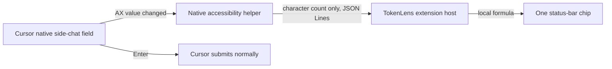

# TokenLens Live Status-Bar Chip Plan

Status: implementation complete for local testing in version 0.4.0; the full
installed-extension acceptance matrix remains pending.

Implementation note: the installed Swift compiler and macOS SDK on the target
machine are mismatched and cannot compile AppKit. The native helper therefore
uses Objective-C with Apple Clang while retaining the planned standalone
process, ApplicationServices/AppKit APIs, arm64 target, JSONL protocol, privacy
boundary, lifecycle, and test coverage. The helper can be moved to Swift later
without changing the extension-side protocol.

Target development environment:

- Cursor 3.14.27.
- macOS on Apple silicon.
- Local installation only; Marketplace publication is not required.

This implementation replaces the runtime behavior described in
`TokenLens_Cursor_Plan.md`. Version 0.4.0 no longer contains the blocking gate,
prompt bridge, or managed Cursor hook.

## Product outcome

TokenLens should estimate the cost of the prompt currently being typed in
Cursor's native side-chat box and show the result only in one status-bar chip.

The intended workflow is:

1. The user enables **TokenLens: Enable Live Estimate** once.
2. macOS asks for Accessibility permission if it has not already been granted.
3. The user types normally in Cursor's native side-chat box.
4. The TokenLens status-bar chip updates within 200 milliseconds of a change.
5. Pressing Enter submits the prompt normally on the first press.
6. TokenLens does not install or run a `beforeSubmitPrompt` hook.
7. Cursor therefore has no TokenLens blocking event to report.

The regular estimate display remains deliberately small:

```text
Est. $0.01100
```

The chip tooltip may explain the character count, approximate token count, and
formula. TokenLens must not add an estimate above or below Cursor's prompt box,
and it must not show routine estimate notifications.

## Behavioral change from version 0.3.1

The version 0.3.1 two-Enter confirmation gate was removed.

| Version 0.3.1 | Planned live-chip version |
| --- | --- |
| First Enter estimates and blocks | Typing updates the estimate continuously |
| Second unchanged Enter submits | First Enter submits normally |
| Uses `beforeSubmitPrompt` | Does not use a Cursor prompt hook |
| Cursor can show a blocking warning | No hook block occurs |

This tradeoff is intentional. Cursor cannot both submit normally and pause for
confirmation without some form of interception. The live chip gives the user
the estimate before Enter, so the blocking gate is no longer needed.

## Why a native helper is needed

The supported VS Code/Cursor extension API does not expose draft-change events
for Cursor's built-in side-chat composer. Chat participants receive a prompt
after the user makes a request, and `beforeSubmitPrompt` receives it after Enter.
Neither API can update TokenLens on every native-composer keystroke.

A normal extension also runs in an extension-host process and cannot inspect
Cursor's renderer DOM. TokenLens will therefore use a small, local macOS helper
that reads the focused accessibility element exposed by Cursor.

This is an operating-system integration, not an official Cursor integration.
The design must have an explicit feasibility gate because Cursor may not expose
enough stable accessibility metadata to distinguish its chat composer from an
editor, terminal, search field, or other text box.

## Proposed architecture



There is deliberately no hook, bridge server, renderer injection, network
request, clipboard polling, or Enter interception in this design.

### Component 1: macOS accessibility helper

Create a standalone native command-line executable that links AppKit and
ApplicationServices. The implementation is Objective-C/Apple Clang because of
the local Swift/SDK mismatch. A separate executable is preferred over a Node
native addon because it avoids Electron and Node ABI compatibility problems.

The helper will:

1. Check trust with `AXIsProcessTrustedWithOptions`.
2. Find the frontmost application with
   `NSWorkspace.shared.frontmostApplication`.
3. Continue only when the application is Cursor. The stable-build bundle ID in
   the current test environment is `com.todesktop.230313mzl4w4u92`.
4. Create an `AXObserver` for Cursor's process ID.
5. Observe focused-window and focused-element changes.
6. Attach a value-change observer only after the focused element has been
   classified confidently as Cursor's side-chat composer.
7. Read the value in memory, count Unicode scalar values, and immediately
   discard the string.
8. send only the count and state over stdout.

The initial notifications to investigate are:

- `kAXFocusedWindowChangedNotification`.
- `kAXFocusedUIElementChangedNotification`.
- `kAXValueChangedNotification`.
- `kAXUIElementDestroyedNotification`.

If Cursor does not emit value-change notifications reliably, a bounded polling
fallback may read the already-validated element every 150 milliseconds while
Cursor and its chat field are focused. Polling must stop immediately when focus
changes or live estimation is disabled. Every polling read must first recheck
Accessibility trust, frontmost Cursor PID, current focused-element identity, and
the full metadata classifier so a missed notification cannot extend access.

### Component 2: composer classifier

The largest technical risk is identifying the correct accessibility element.
An `AXTextArea` role by itself is not sufficient because code editors and other
inputs may expose the same role.

The classifier should consider only non-content metadata. The implemented
classifier requires this exact pair of independent Cursor invariants:

- The focused text element has the `aislash-editor-input` DOM class and supports
  a value.
- Its bounded parent chain contains `composer-input-blur-wrapper`,
  `ai-input-full-input-box`, or `composer-bar`.

The helper separately allowlists Cursor's bundle ID and process before it
classifies any focused element. Diagnostic output may include roles, stable DOM
identifiers/classes, supported attribute names, and a bounded parent chain, but
not descriptions, titles, help text, placeholders, or accessibility values.

The classifier must fail closed. If the element cannot be identified with a
stable signature, TokenLens should report `Waiting for Cursor chat` in its chip
instead of estimating the contents of an editor or unrelated input.

The production helper must never log an element's value. A diagnostic mode may
log roles, identifiers, and hierarchy metadata, but not text content.

### Component 3: private local protocol

The extension will spawn the bundled helper with an absolute path and exchange
newline-delimited JSON over stdin and stdout. The helper must not open a socket.

Proposed helper-to-extension messages:

```json
{"version":1,"type":"permission","trusted":false}
{"version":1,"type":"state","state":"waiting-for-chat","generation":3,"observation":8}
{"version":1,"type":"draft-length","characters":1000,"generation":3,"observation":8}
{"version":1,"type":"state","state":"draft-empty","generation":3,"observation":8}
{"version":1,"type":"error","code":"cursor-not-accessible","generation":3}
```

Proposed extension-to-helper messages:

```json
{"version":1,"command":"set-active","active":true,"generation":3}
{"version":1,"command":"set-active","active":false,"generation":4}
{"version":1,"command":"request-permission"}
{"version":1,"command":"shutdown"}
```

Protocol requirements:

- Prompt text is never sent across the pipe.
- Each line has a small fixed maximum size, such as 4 KiB.
- Unknown versions, message types, fields, and invalid counts are rejected.
- Native and TypeScript readers both treat 4 KiB as the complete frame size,
  including LF, and discard an oversized frame through its next LF.
- Every activation-dependent message echoes the current generation so buffered
  frames from a previously focused window are rejected.
- stderr contains short diagnostic codes only and never accessibility values.
- A malformed helper message cannot change settings or execute a command.

### Component 4: extension-side controller

The TypeScript extension will own the helper process and status-bar state.

The controller will:

- Start the helper only when live estimation is enabled on macOS.
- Verify that the expected bundled executable exists before spawning it.
- Use pipes rather than an inherited terminal.
- Parse JSON Lines incrementally with size limits.
- Drain helper stdout through process close before finalizing the JSONL decoder.
- Reject activation-dependent frames whose generation does not match the
  current focus state.
- Debounce chip rendering so rapid input does not cause excessive UI work.
- Stop the helper during extension deactivation.
- Apply bounded restart backoff after unexpected helper exits.
- Never restart repeatedly after permission denial or an unsupported state.
- Pause observation when its Cursor window loses focus by using
  `vscode.window.onDidChangeWindowState`.

Window-focus coordination is important because several Cursor windows can each
activate TokenLens. Only the focused window's extension instance should tell its
helper to observe. A background Cursor window must not update its chip from text
typed in a different Cursor window. The app-wide enabled setting must also
publish change events to every already-open extension host so disabling in one
window stops the helper in all windows.

### Component 5: estimator and presentation

Refactor the existing estimator so it can accept a character count directly.
The formula remains:

```text
estimate = $0.001 + (Unicode character count × $0.00001)
approximate tokens = ceil(Unicode character count ÷ 4)
```

Only non-empty, confidently identified chat drafts receive a cost estimate.
The implemented chip states are:

| State | Chip text |
| --- | --- |
| Disabled | `Live estimate off` |
| Permission missing | `Grant Accessibility` |
| Cursor is not focused | `Live estimate paused` |
| Cursor is focused but chat is not | `Waiting for Cursor chat` |
| Chat draft is empty | `Start typing for estimate` |
| Valid non-empty draft | `Est. $0.01100` |
| Unsupported environment | `Live estimate unavailable` |

Clicking the chip should open a small action menu. It must not create a second
estimate display.

## Privacy and security requirements

Accessibility permission is broad, so this design needs stricter boundaries
than the current hook implementation.

- Live observation is opt-in and clearly explained before the permission prompt.
- The helper runs only while TokenLens live estimation is enabled.
- It processes only the frontmost Cursor application.
- It reads a value only after the composer classifier succeeds.
- It rechecks trust, frontmost Cursor PID, current focused element identity, and
  the classifier immediately before every value read, including polling reads.
- It sends only the Unicode character count to the extension.
- Prompt text is never logged, persisted, sent over a socket, or sent to a
  network service.
- Attachments, files, chat history, hidden context, and model responses are not
  read.
- The helper must not set accessibility values or perform accessibility actions.
- The helper must not synthesize keystrokes or intercept Enter.
- No clipboard access is used.
- The executable is launched from an extension-owned absolute path, never from
  `PATH`.
- Disabling TokenLens terminates the helper and returns the chip to the disabled
  state in every open Cursor window.

The permission explanation should state that macOS grants broad UI-reading
access even though TokenLens intentionally restricts itself to the focused
Cursor chat field.

## Legacy hook removal

Removing the bridge from the extension is not sufficient. Earlier TokenLens
versions copied a managed hook into each enabled project. Those projects need a
safe, one-time migration.

The migration must:

1. Stop the current prompt bridge before changing project configuration.
2. Find only the exact command
   `node .cursor/hooks/tokenlens-before-submit.cjs` in
   `.cursor/hooks.json`.
3. Remove only matching TokenLens entries from `beforeSubmitPrompt`.
4. Preserve every other hook, JSONC comment, property, and formatting style.
5. Remove an empty `beforeSubmitPrompt` array only when TokenLens made it empty.
6. Delete `.cursor/hooks/tokenlens-before-submit.cjs` only if it contains the
   TokenLens ownership marker.
7. Remove `.tokenlens/bridge.json` only if it matches the TokenLens registration
   schema.
8. Record a versioned workspace migration flag so cleanup is not repeated.
9. Fail without touching ambiguous or user-owned files.

The source repository and VSIX should also stop including:

- `.cursor/hooks.json` with the TokenLens prompt hook.
- `.cursor/hooks/tokenlens-before-submit.cjs`.
- The loopback prompt bridge.
- The two-Enter fingerprint gate.
- Enable/disable commands whose wording refers to an estimate gate.

The replacement commands should be:

- **TokenLens: Enable Live Estimate**.
- **TokenLens: Disable Live Estimate**.
- **TokenLens: Request Accessibility Permission**.
- **TokenLens: Diagnose Live Draft Detection**.

Routine use should require only the first two commands. The diagnostic command
must never print prompt content.

## Implementation phases

### Phase 0: accessibility feasibility spike

Core feasibility passed for the target Cursor 3.14.27 environment. The spike
established that:

- the empty native side-chat field is exposed as `AXTextArea`;
- its DOM class is `aislash-editor-input`;
- its bounded parent chain includes `ai-input-full-input-box`,
  `composer-input-blur-wrapper`, and `composer-bar` classes;
- the installed VSIX helper retains mode `0755`, its ad-hoc signature verifies,
  and it reports existing Accessibility trust from its installed path;
- the helper reports `draft-empty` for an empty composer and changing character
  counts for typed content; and
- the Command Palette and editor focus fail the two-invariant classifier and
  never reach the value-read path.

The diagnostic command remains available for manual checks after Cursor
updates. The broader IME, multi-window, permission-revocation, and long-duration
latency matrix remains an installed-extension acceptance exercise rather than a
compile-time guarantee.

Build a minimal, local Swift diagnostic that:

1. Confirms how the Accessibility permission is attributed and displayed by
   macOS when the helper is launched from Cursor.
2. Locates Cursor by bundle ID and process ID.
3. Reports only accessibility roles, stable DOM identifiers/classes, supported
   attribute names, and parent hierarchy for the focused element.
4. Compares the side-chat field with the editor, terminal, search box, Command
   Palette, settings search, and rename input.
5. Determines a stable composer signature.
6. Confirms value-change delivery for typing, paste, delete, selection
   replacement, undo, multiline input, emoji, and input-method editors.
7. Confirms that the helper can count without emitting the text.
8. Measures event latency and idle CPU use.

Go criteria:

- The side-chat field is distinguishable without examining its text.
- False positives are not observed in the tested Cursor inputs.
- Text changes arrive consistently within 200 milliseconds.
- Permission survives normal Cursor and extension reloads.
- The helper can be bundled and launched from a locally installed VSIX.

No-go criteria:

- The chat field and editor expose indistinguishable metadata.
- Cursor does not expose the draft value through Accessibility.
- Detecting the field requires screen scraping, OCR, keystroke capture, or DOM
  injection.
- Permission identity changes after every build or reload in a way that makes
  normal use impractical.

If any no-go criterion occurs, stop this architecture and use the fallback
described below.

### Phase 1: native helper and protocol

- Create a standalone native executable target. The implementation uses
  Objective-C/Apple Clang because the installed Swift compiler and SDK are
  mismatched.
- Add abstractions around the accessibility client and element classifier so
  most logic can be unit tested without controlling Cursor.
- Implement permission, app-focus, element-focus, and value-change states.
- Implement Unicode scalar counting.
- Implement the strict JSON Lines protocol.
- Add graceful shutdown and signal handling.
- Add a release build that targets the current `darwin-arm64` environment.
- Use a fixed ad-hoc signing identifier for local installation. It preserves
  trust when the exact installed binary reloads on the tested machine, but a
  rebuilt binary has a new macOS code identity and may require permission again;
  a distributable release would need a stable Developer ID identity.

Deliverable: running the helper manually emits state and character counts, but
never text, while the Cursor composer is focused.

### Phase 2: extension integration and live chip

- Add a helper-process controller to the extension.
- Add protocol validation, line limits, lifecycle management, and restart
  backoff.
- Refactor the estimator to accept a character count.
- Add the new chip states and tooltip content.
- Add live enable, disable, permission, and diagnostic commands.
- Store opt-in in an application-scoped, non-synced Cursor configuration and
  react to its changes in every extension host because Accessibility permission
  is application-wide rather than project-specific.
- Coordinate multiple Cursor windows using window-focus events.
- Keep normal operation silent except for the status-bar chip.

Deliverable: typing in native Cursor side chat updates one chip, and Enter still
submits normally.

### Phase 3: remove the blocking architecture

- Implement and test the one-time legacy cleanup routine.
- Stop starting `SubmittedPromptBridge`.
- Remove `PromptConfirmationGate` and its state.
- Remove hook installation and the copied hook script from the VSIX.
- Remove bridge registration files and related tests.
- Update command names, README instructions, and the original product plan.
- Increment the extension version.

Deliverable: TokenLens never returns `continue: false` because it no longer runs
a prompt hook.

### Phase 4: hardening, packaging, and acceptance testing

- Build the native helper before the TypeScript production bundle.
- Include only the correct platform helper in the VSIX.
- Preserve the executable permission in the packaged artifact.
- Verify the installed extension launches the packaged helper rather than a
  development path.
- Validate behavior after **Developer: Reload Window**, Cursor restart, and
  VSIX upgrade from version 0.3.1.
- Test permission granted, denied, later granted, and revoked while running.
- Test helper crash, malformed output, unsupported Cursor version, and multiple
  Cursor windows.
- Measure idle CPU and memory use.
- Run TypeScript, native, integration, packaging, and smoke tests.

Deliverable: a locally installable VSIX with no blocking hook and a reliable
live status-bar estimate.

## Proposed file layout

The exact names may change during the feasibility spike, but the intended
separation is:

```text
native/macos/Sources/main.m
native/macos/Sources/TLAccessibilityObserver.h
native/macos/Sources/TLAccessibilityObserver.m
native/macos/Sources/TLComposerClassifier.h
native/macos/Sources/TLComposerClassifier.m
native/macos/Sources/TLProtocol.h
native/macos/Sources/TLProtocol.m
native/bin/darwin-arm64/tokenlens-ax-observer
scripts/build-native.mjs
scripts/test-native.mjs
scripts/verify-native.mjs
scripts/verify-vsix.mjs

src/liveDraft/helperController.ts
src/liveDraft/protocol.ts
src/liveDraft/liveEstimateCoordinator.ts
src/simpleEstimator.ts
src/ui/presentation.ts
src/ui/statusBarController.ts
src/extension.ts

test/liveDraftProtocol.test.ts
test/helperController.test.ts
test/liveEstimateCoordinator.test.ts
test/presentation.test.ts
test/simpleEstimator.test.ts
test/legacyHookRemoval.test.ts
```

The release binary directory should contain generated build output, while
Objective-C source and tests remain reviewable.

## Test strategy

### Automated TypeScript tests

- Character-count estimate monotonicity and formatting.
- Empty and non-empty draft presentation.
- Every helper protocol message and invalid-message case.
- Partial lines, oversized lines, invalid JSON, and process termination.
- Debouncing and stale-event rejection.
- Focus changes between multiple Cursor windows.
- Permission, waiting, paused, unsupported, and error chip states.
- No notification or prompt-box estimate path.
- Safe removal of the exact legacy hook while preserving other JSONC hooks and
  comments.
- Refusal to delete a script without the ownership marker.

### Automated native tests

- Unicode scalar counting, including emoji and composed characters.
- JSON protocol encoding with no text field.
- Exact version, frame-size, and split oversized-frame rejection.
- Composer-classifier decisions from sanitized accessibility snapshots.
- Diagnostic string, array, and parent-depth caps shared with TypeScript.
- Application bundle-ID allowlisting.
- State transitions when elements become invalid or focus changes.
- Notification coalescing and polling-fallback lifecycle.

### Integration tests

- A fake helper process drives the real TypeScript controller and status model.
- The extension stops and restarts a crashed helper with bounded backoff.
- Disable and deactivate terminate the helper.
- Malformed helper output cannot update the chip.
- A legacy version 0.3.1 workspace migrates without disturbing unrelated hooks.
- The packaged VSIX contains the correct helper and no TokenLens hook script.

### Manual acceptance matrix

Test at least the following in normal Cursor, not only an Extension Development
Host:

- Short and long prompts.
- Fast typing and key repeat.
- Paste, cut, undo, redo, and select-all replacement.
- Multiline prompts and Shift+Enter.
- Emoji, accented characters, and an input-method editor.
- Switching between chat, editor, terminal, search, settings, and Command
  Palette.
- Opening and closing the side chat.
- Switching Cursor windows and workspaces.
- Clearing a draft and submitting it.
- First Enter submits without a TokenLens hook warning.
- Accessibility permission denial and later approval.
- Cursor restart and extension upgrade.

## Acceptance criteria

The live-chip architecture is complete only when all of these are true:

1. A non-empty native Cursor side-chat draft updates the status chip within 200
   milliseconds in normal use.
2. Longer draft text always produces a larger unrounded estimate.
3. Editor, terminal, search, settings, and Command Palette text never produce a
   prompt estimate.
4. The visible estimate appears only in the TokenLens status-bar chip and its
   tooltip.
5. Pressing Enter once submits the prompt normally.
6. Cursor does not show a TokenLens `beforeSubmitPrompt blocked this submission`
   warning.
7. No TokenLens `beforeSubmitPrompt` entry remains after the safe migration.
8. Prompt text never appears in helper stdout, stderr, extension logs, files,
   sockets, telemetry, or network traffic.
9. Permission denial and helper failure do not prevent normal Cursor use.
10. Idle observation does not create noticeable CPU or battery use.
11. All automated validation and installed-VSIX smoke tests pass.

## Fallback if Accessibility is not reliable

If Phase 0 fails, do not implement keystroke capture, OCR, renderer DOM
injection, remote debugging, clipboard polling, or database scraping.

The supported fallback is a TokenLens-owned Webview View containing its own
prompt input. Because TokenLens owns that input, it can update the chip on every
input event. The disadvantages are that it is not Cursor's native prompt box and
there is no supported API guaranteed to transfer and submit the draft to Cursor
Agent.

The simpler fallback is to keep a non-blocking `beforeSubmitPrompt` hook that
always returns `continue: true`. It would eliminate the blocking warning and
update the chip only when Enter is pressed, but it would not provide a live
pre-submit estimate.

The Accessibility feasibility result should decide between these fallbacks; the
implementation should not silently switch to a less private technique.

## Known risks and mitigations

| Risk | Mitigation |
| --- | --- |
| Cursor changes its accessibility tree | Isolate the classifier, fail closed, and report unsupported state |
| Broad macOS permission | Explicit opt-in, Cursor-only process check, value read only after classification |
| Accidental prompt disclosure | Count in helper, IPC count only, prohibit value logging |
| Multiple Cursor windows | Pause background instances using window-focus state |
| Helper crashes | Fail open, keep Cursor unaffected, and use bounded restart backoff |
| High CPU from polling | Prefer AX notifications; poll only a focused validated element at a bounded interval |
| Repeated macOS permission prompts | Launch the packaged helper from its absolute extension path, ad-hoc sign it deterministically, and surface a direct permission command |
| Stale legacy hooks | Exact, ownership-checked, one-time JSONC-preserving migration |
| Unsupported platform | Clear unavailable chip state; never attempt to execute the macOS helper |

## References

- [Cursor Hooks documentation](https://cursor.com/docs/hooks)
- [VS Code Chat Participant API](https://code.visualstudio.com/api/extension-guides/ai/chat)
- [VS Code Webviews](https://code.visualstudio.com/api/ux-guidelines/webviews)
- [VS Code Status Bar guidance](https://code.visualstudio.com/api/ux-guidelines/status-bar)
- [Apple AXUIElement documentation](https://developer.apple.com/documentation/applicationservices/axuielement_h)
- [Apple AXIsProcessTrustedWithOptions documentation](https://developer.apple.com/documentation/applicationservices/1459186-axisprocesstrustedwithoptions)
- [Apple NSWorkspace frontmostApplication documentation](https://developer.apple.com/documentation/appkit/nsworkspace/frontmostapplication)
